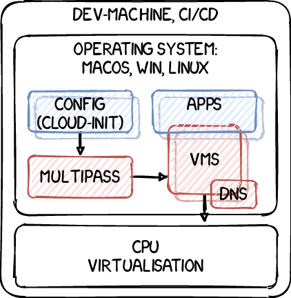

# Multipass Demo

Multipass is an easy-to-spin and easy-to-use tool for creating and using development environments on workstations. Here we will show Multipass and some tooling around it.

Multipass basically continues where Vagrant left, and we will show how and why multipass can help you being more productive, using it in development and testing.

https://multipass.run

## Background

- https://multipass.run/
- https://multipass.run/docs
- https://discourse.ubuntu.com/c/multipass
- https://github.com/canonical/multipass

## Demo Repo

https://github.com/delvrit/demo-multipass-dev

## Maintainers

See [maintainers](MAINTAINERS.md).

## Changelog

See [changelog](CHANGELOG.md).

## License

All content is, if not stated otherwise in the sub-repo, [licensed](LICENSE.md) under the Apache License, Version 2.0:

> Copyright 2018 the original author or authors.
> License: Apache License, Version 2.0
>
> Licensed under the Apache License, Version 2.0 (the "License");
> you may not use this file except in compliance with the License.
> You may obtain a copy of the License at
>
>      http://www.apache.org/licenses/LICENSE-2.0
>
> Unless required by applicable law or agreed to in writing, software
> distributed under the License is distributed on an "AS IS" BASIS,
> WITHOUT WARRANTIES OR CONDITIONS OF ANY KIND, either express or implied.
> See the License for the specific language governing permissions and
> limitations under the License.
